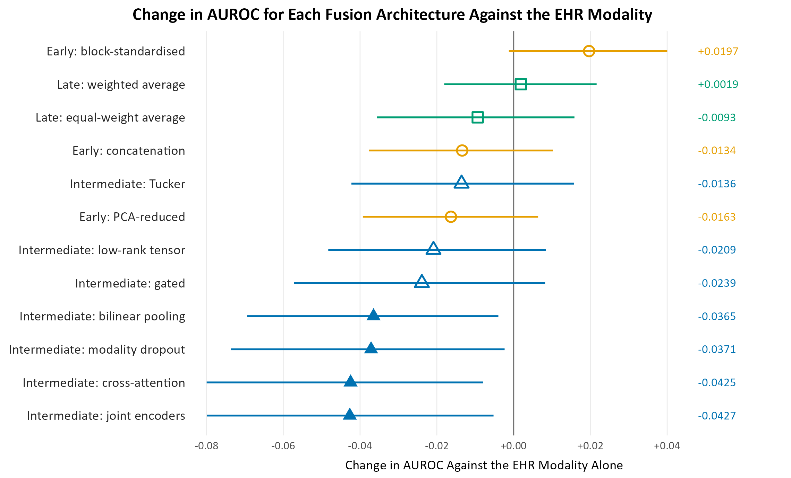
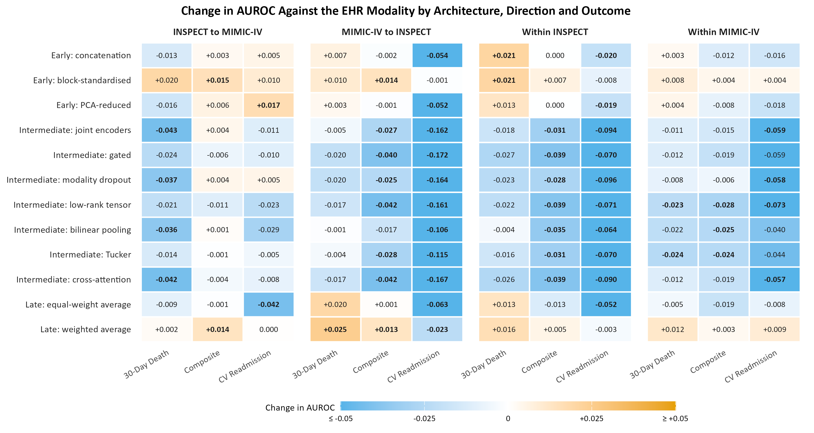
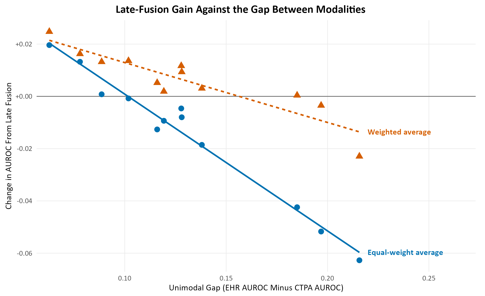
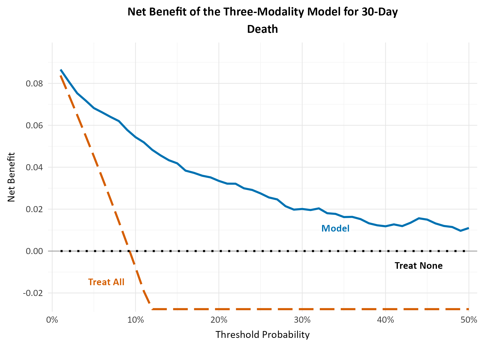

# Bidirectional Transfer and Multimodal Fusion for Prognosis After Pulmonary Embolism

Post-dissertation side project, 2026. It extends the MSc Data Science dissertation in [pe-multimodal-prognosis-msc](https://github.com/andmahoff/pe-multimodal-prognosis-msc).

This repository holds the analysis code, the R figure scripts and the aggregate result tables. It is research code shared for transparency and reproducibility, not a maintained software package.

## Summary

The dissertation combined several modalities by late fusion to predict outcomes after acute pulmonary embolism (PE). This project asks three follow-up questions:

1. **Which fusion family works across hospitals?** Structured electronic health records (EHR) and computed tomography pulmonary angiography (CTPA) report features were trained at one hospital and applied to another without target labels, in both directions between Stanford INSPECT and MIMIC-IV, and compared with training and testing within each site. Early, intermediate and late fusion were compared, with 3 early, 7 intermediate and 2 late variants.
2. **What predicts when fusion helps?** The gain from fusion was related to the AUROC gap between the two modalities.
3. **Can a tree ensemble fuse EHR, ECG and CTPA better than late fusion?** A block-stratified random forest was built on the MIMIC-IV three-modality cohort and validated with nested cross-validation.

The primary contrast was fixed before any modelling: early against intermediate against late fusion of EHR and CTPA, trained on INSPECT and evaluated on MIMIC-IV, for 30-day death. Every other analysis is secondary and exploratory.

## Key results

**Primary contrast (INSPECT to MIMIC-IV, 30-day death).** No fusion architecture was significantly better than the EHR modality alone (AUROC 0.8460). Block-standardised early fusion had the largest gain, +0.0197, but its interval (-0.0012 to +0.0400) includes zero. Four intermediate variants were significantly worse, including plain joint encoders at 0.8026 (-0.0427).

  

*Change in AUROC against the EHR modality alone for each of the 12 fusion architectures, INSPECT to MIMIC-IV, 30-day death. Filled points have 95% intervals that exclude zero.*

**Across all four directions and three outcomes:**

- Intermediate fusion was never significantly better than the EHR modality in any of its 84 cells (7 variants by 12 direction-outcome cells). It was significantly worse in 40 of them, including the low-rank tensor, bilinear, Tucker and cross-attention variants.
- Block-standardised early fusion and weighted late fusion were each positive in 10 of 12 cells, with 3 significant. The largest single gain was weighted late fusion from MIMIC-IV to INSPECT on 30-day death, +0.0248 (+0.0132 to +0.0365).

  

*Change in AUROC against the EHR modality for every architecture, transfer direction and outcome. Bold values have intervals that exclude zero. The colour stops at plus or minus 0.05, while the printed values show the full change.*

**The gap rule.** The narrower the AUROC gap between the two modalities, the larger the late-fusion gain. Across the 12 direction-outcome cells the correlation was r = -0.986 for equal-weight late fusion and r = -0.906 for weighted late fusion. Across the 12 modality pairings of the three-modality cohort it was r = -0.902. All three have p < 0.001.

  

*Late-fusion gain against the unimodal gap (EHR AUROC minus CTPA AUROC), across the 12 direction-outcome cells, with a fitted line for each late-fusion rule.*

**Calibration by fusion family.** Weighted late fusion was the best calibrated, with a median calibration slope of 0.86 (range 0.72 to 1.28). Intermediate fusion was badly over-confident (median 0.21), and block-standardised early fusion was under-confident (median 1.51).

**Final three-modality model.** A block-stratified random forest on EHR, ECG and CTPA features, on 1,636 MIMIC-IV admissions with all three modalities. The figures below come from nested cross-validation, in which the tuning is repeated inside each outer fold.

| Outcome | Nested-CV AUROC | Optimism removed | Net benefit above treat-all and treat-none |
|---|---|---|---|
| In-hospital death | 0.9046 | 0.0115 | thresholds 1% to 48% |
| 30-day death | 0.8973 | 0.0043 | thresholds 1% to 50% |
| Composite (30 days) | 0.8537 | 0.0080 | thresholds 1% to 50% |
| Cardiovascular readmission | 0.8190 | 0.0024 | thresholds 1% to 36% |

After Platt scaling the calibration slopes were 0.92 to 0.96. The tuned settings form a plateau rather than a sharp optimum: 29 of 32 draw-by-regularisation combinations were statistically tied with their outcome's best.

  

*Decision curve for 30-day death: net benefit of the final three-modality model against treating all patients and treating none. Curves for the other three outcomes are in `figures/`.*

**Other findings:**

- Training the CTPA modality on INSPECT and applying it zero-shot to MIMIC-IV cost 0.010 to 0.081 AUROC against training within MIMIC-IV on the same 38 features.
- Using the 1,865 admissions without a CTPA report for training, with CTPA left missing, did worse than ignoring CTPA altogether on all four outcomes (-0.0058 to -0.0266).
- Rotation forests gave no significant gain over the plain block forest: every paired bootstrap interval spanned zero.
- Evidential (Dempster-Shafer) fusion did not beat weighted rank averaging with any of its four ignorance strategies.

## Data access

This repository contains no patient data, no patient-level derived files (predictions, feature matrices, labels) and no fitted models. Models trained on MIMIC-IV count as derived data under the PhysioNet data use agreement, so they cannot be shared here.

To reproduce the analyses you need your own access to:

- MIMIC-IV, MIMIC-IV-ED, MIMIC-IV-Note and MIMIC-IV-ECG (PhysioNet credentialed access). Script 03 reads MIMIC-IV through BigQuery.
- INSPECT (Stanford AIMI, via Redivis, under the Stanford data use agreement), for the CTPA impressions, labels and EHR condition flags
- the PTB-XL benchmark model published by Strodthoff et al. (2020), used for the ECG modality
- the derived files produced by the dissertation pipeline in [pe-multimodal-prognosis-msc](https://github.com/andmahoff/pe-multimodal-prognosis-msc), which this project starts from

## What is in this repository

| Folder | Contents |
|---|---|
| `scripts/` | Python analysis scripts, numbered in the order they were written, plus the shared module `fusion_lib.py` |
| `R/` | R scripts for the figures in this README |
| `results/` | Aggregate result tables, one row per model, outcome or cell |
| `figures/` | The PNG images shown in this README |

`results/evidential.csv` and `results/evidential_mass.csv` come from an earlier version of script 94, which computed the Brier score on percentile ranks. `94_evidential_fixed.py` describes the correction.

## Running the code

The scripts ran on a Windows laptop. Run every script from the project folder, the one that contains `scripts/`, because the scripts read and write `data/processed/` relative to it.

**Environments.** Each script's header names its environment:

| Environment | Used by | Requirements file |
|---|---|---|
| `venv` (analysis) | most scripts | `requirements.txt` |
| `venv_ecg` | ECG download, waveform measurements and PTB-XL feature extraction | `requirements-ecg.txt` |
| `venv_nlp` | transformer embeddings of CTPA text (script 15) | `requirements-nlp.txt` |
| `venv_dl` | INSPECT download from Redivis (scripts 01 and 02) | `requirements-download.txt` |

The analysis environment uses Python 3.11 and the CPU build of PyTorch. To install `torch==2.5.1+cpu` from `requirements.txt`, add `--extra-index-url https://download.pytorch.org/whl/cpu` to the `pip install` command.

**Environment variables:**

| Variable | Used by | Purpose |
|---|---|---|
| `PE_DISS_DIR` | `fusion_lib.py` and several scripts | folder holding the dissertation's derived files; defaults to `../Dissertation` |
| `GCP_PROJECT_ID` | script 03 | Google Cloud project with PhysioNet BigQuery access |
| `REDIVIS_API_TOKEN` | scripts 01 and 02 | Redivis access token for INSPECT |
| `TABPFN_TOKEN` | script 107 | TabPFN access token |

Script 41 prompts for a PhysioNet password when it runs; nothing is stored. Scripts 58 and 61 expect the PTB-XL benchmarking outputs at `~/ecg_ptbxl_benchmarking/output/exp0/`. Scripts 50, 51 and 59 read PTB-XL checkpoints saved by the dissertation, under `PE_DISS_DIR/HPC`.

**R figures.** The R scripts use ggplot2, dplyr, ragg, systemfonts and scales. They read their tables from `Documents/Data Science/SideProject/data/processed` and save images to `Documents/Data Science/SideProject/R Graphs`, both under the Windows user profile. Change `data_dir` and `fig_dir` at the top of a script to run it elsewhere. The tables they need are in `results/`.

## How the scripts are organised

| Scripts | Stage |
|---|---|
| 01 to 06 | INSPECT download, the rebuild of the MIMIC-IV vitals, and reproduction of the dissertation's EHR and CTPA modalities |
| 07 to 10 | Unimodal baselines, the main fusion grid (12 architectures, 4 directions, 3 outcomes), calibration and the gap regression |
| 11 to 21 | Scaling of source-trained models, transformer encoders for CTPA text, the tuned grid and gap, and the supervision ladder |
| 22 to 27 | Moderators of fusion gain, encoder capacity, dropout and fusion mechanisms |
| 28 to 36 | Adding the ECG modality, comparison with the dissertation, and when a third modality is worth adding |
| 37 to 41 | MIMIC-IV-ECG download |
| 42 to 87 | The ECG modality: derived waveform measurements (versions 1 to 12), PTB-XL benchmark outputs, serial-ECG trajectories and their fitting |
| 88 to 94 | Fusion with the improved ECG modality, training on the full cohort, zero-shot CTPA and evidential fusion |
| 96 to 104 | Encoder depth, modality dropout, coordinated representations (PCA, CCA, PLS), cooperative learning, supervised PCA, LOL and model-level fusion |
| 105 to 113 | Learner sweeps, TabPFN, the CCA-augmented random forest, rotation forests, and EHR plus ECG learners |
| 114 to 131 | Block-stratified forests for EHR plus ECG and all three modalities, missing CTPA, modality competence, ensembles, final tuning and nested validation |

Some numbers are absent. They were diagnostics of the local machine, empty files or duplicates.

## Caveats

- **Tuning optimism.** Except for script 131, every figure was tuned on the same out-of-fold predictions it was scored on. Script 131's nested cross-validation puts the resulting optimism at 0.002 to 0.012 AUROC for the final model.
- **Leaf size in scripts 118 to 127.** These scripts fixed the forest's minimum leaf size at 1. Scripts 128 and 129 showed this lowers the block-forest AUROC by 0.007 to 0.025, so the block-forest figures from 118 to 127 are lower bounds. Script 129 repeats the missing-CTPA comparison at a swept leaf size, and its conclusion holds.
- **INSPECT age.** Age is derived as the year of the PE minus the year of birth, giving a median of 62 against the dissertation's 70. The offset applies equally to every comparison.

## Citation and licence

If you use this code, please cite it using `CITATION.cff`, and cite MIMIC-IV, PhysioNet, INSPECT and PTB-XL as their providers request. The code is released under the MIT licence (see `LICENSE`).
